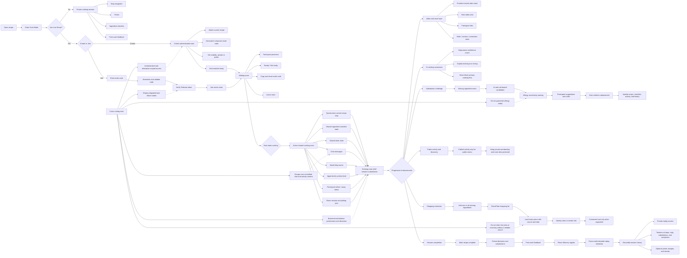

# GlucoPlate Live Cooking Flow

This diagram is the implementation-grounded flow for the current Live Cook Room work and its progressive enhancements.

It reflects the existing authenticated room foundation first: create or join, invite codes, participant presence, ready state, synchronized recipe steps, shared ingredient and timer state, chat, help requests, activity, public-room publishing, and leaving the room.

Video, AI assistance, substitutions, shopping, replay, and gamification extend the same room and cooking-session model. They must not introduce replacement flows, duplicate state, or competing session concepts.

## Task-planning rule

Any task that changes Cooking Mode, live rooms, participants, ingredients, timers, chat, help, activity, substitutions, shopping, video, or replay must identify the node or transition in this flow that it implements or strengthens.

The implemented room shell remains authoritative. Enhancements must attach to the existing room and `CookingSession` direction instead of creating parallel flows.
