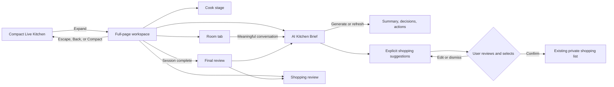

# Live Kitchen Workspace

## Outcome

Live Kitchen keeps its compact companion panel and adds an optional full-page workspace for focused collaborative cooking. Expanding never creates a second room or session model; it changes only presentation while preserving the room, cooking step, timers, ingredient checks, chat, and presence.

## Experience flow

## Information architecture

### Desktop

The workspace has three visual zones:

1. A persistent header for room identity, status, invite actions, compact view, and leave.
2. A dominant cooking stage for shared ingredients, timers, media, and the current step.
3. One contextual rail at a time: Room, AI brief, or Shopping.

Activity remains secondary. The interface avoids a dashboard mosaic and uses the existing green-and-cream visual language, generous spacing, restrained elevation, and clear hierarchy.

### Tablet and mobile

The workspace becomes a single-column, full-height view. Navigation switches between Cook, Room, AI brief, and Shopping so only one primary context competes for attention. Safe areas, reduced motion, keyboard focus, and minimum 44px interaction targets are preserved.

## AI Kitchen Brief

Participants can generate or refresh a structured brief from the current room conversation. The service returns:

- a concise headline and overview;
- decisions;
- next actions;
- explicit shopping suggestions;
- source message identifiers;
- generation time, provider, and transcript revision.

Provider failures fall back to a conservative local extractor. Core cooking, chat, shared state, and timers remain available when insights fail.

## Shopping safety contract

Conversation-derived items are suggestions, never automatic writes. The user must review, edit, select, and confirm items before the existing profile-scoped shopping-list API is called. Negated statements such as “do not buy” or “already have” are excluded by the local fallback. Server-side shopping-list normalization continues to handle duplicate names.

## Acceptance criteria

- Expand and compact controls preserve the active room and its state.
- Escape returns to compact view without leaving the room.
- Desktop shows the cooking stage plus one contextual rail; smaller screens show one primary view.
- The AI brief has idle, loading, success, and retry states.
- Suggested shopping items are editable and selectable.
- No suggestion is saved without explicit confirmation.
- Confirmed items use the existing shopping-list service.
- Insight failure never blocks Live Kitchen collaboration.
- Full-page controls meet touch, focus, contrast, safe-area, and reduced-motion expectations.
