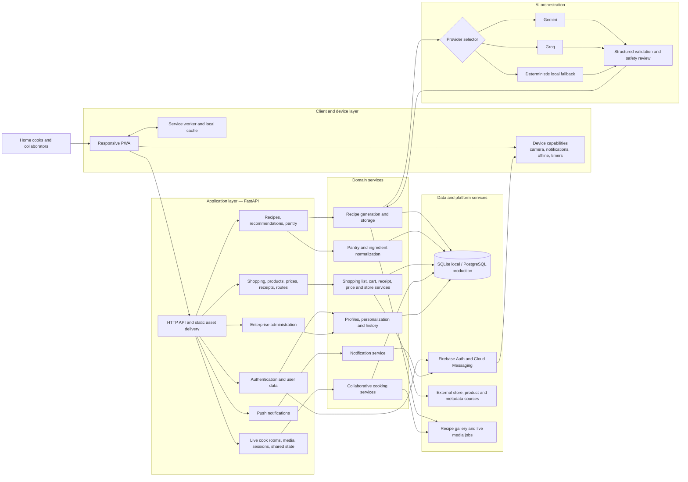

# System Architecture

This document provides a system-level view of GlucoPlate AI. It reflects the current repository structure and the major runtime integrations.

## Architectural responsibilities

- **Client and device layer:** Delivers the responsive cooking experience, offline behavior, timers, camera-assisted flows, and notification handling.
- **FastAPI application layer:** Serves the PWA and exposes bounded API surfaces for identity, recipes, commerce, live cooking, notifications, and administration.
- **Domain services:** Encapsulate recipe, pantry, shopping, collaboration, profile, and notification workflows.
- **AI orchestration:** Selects a configured model provider, validates structured recipe output, and falls back to deterministic local generation when needed.
- **Data and platform services:** Persist application state and integrate authentication, messaging, media jobs, and product/store metadata.

## Primary request flow

1. A user acts through the PWA.
2. FastAPI routes the request to the appropriate domain API and service.
3. Recipe requests enter AI provider selection and always retain a local fallback path.
4. Services persist state or call external platform integrations.
5. The API returns structured data to the PWA; Firebase handles asynchronous push delivery.
